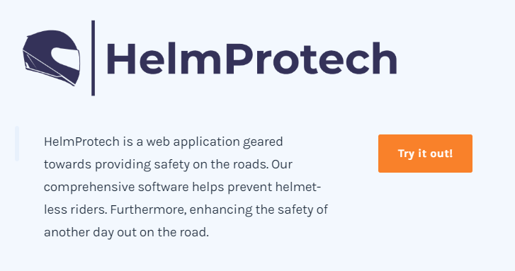
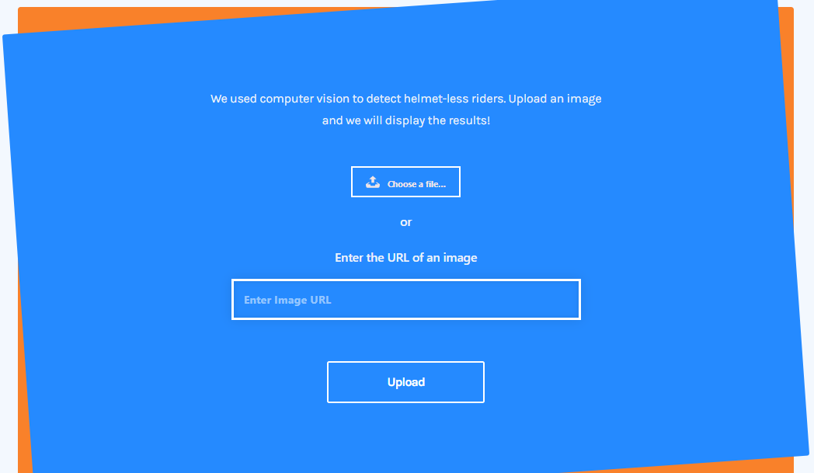
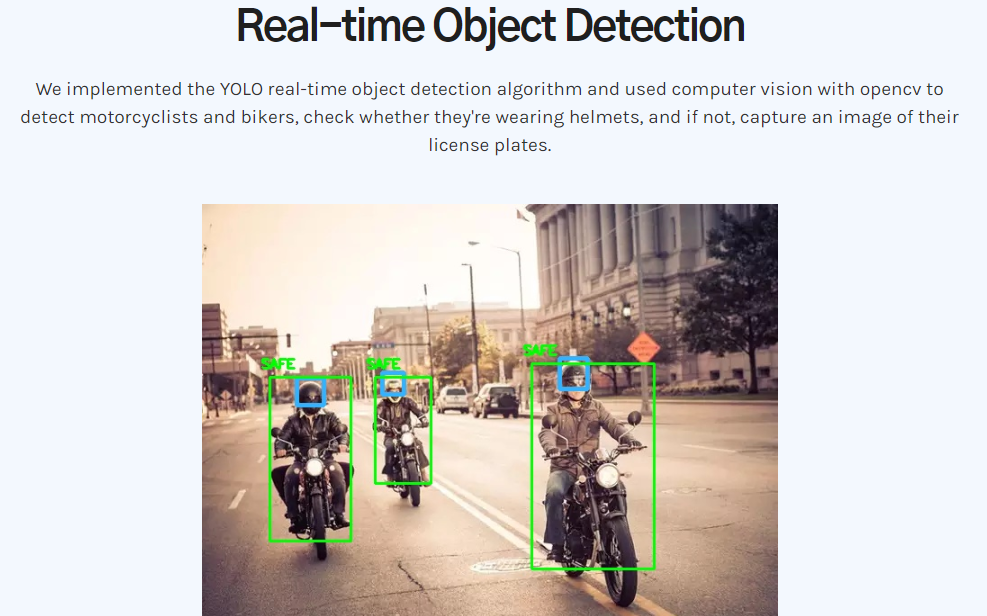

# HelmProtech
This project was done for the DefHacks Virtual 2020 Hackathon. The competitions main theme was creating something to help with health and general well being of others. We decided to create an application that helps with safety on the road by detecting if somebody riding a bike or motorcycle is not wearing proper safety gear such as a helmet. Our Flask application take an input of images of motorcycle riders on the street. With these images, we use YOLO to find the number of motorcycles and the number of helmets in the picture and subtract that amount. If we find that there are more motorcycles than helmets (signifying that there are some riders not wearing the proper gear), we scan the license plates and map the plates to the motorcyclist that wasn't wearing a helmet, then use OCR to find and save the license plate which violated the rules.

A link to our devpost submission can be found here: https://devpost.com/software/helmprotech

A link to our YouTube demo video can be found here: https://youtu.be/1SbBZqdJNU0

The app is currently deployed to Google Cloud Platform here: https://helmprotech.uk.r.appspot.com/

## Screenshots 

This is a sneak peek at our landing page. We describe our mission, function, and how the entire software package works. 

This is where users can try it out for themselves and either upload an image or enter an image URL.

Upon uploading an image, users will be prompted to the results page in which this is one of the output that will be shown, a clear analyziation of the image and whether or not the rider is safe and if they have on the proper gear for protection.


## Features

* Finding objects in pictures using YOLO
* Reading and parsing images with OpenCV
* Reading license plates with OCR in UiPath Studios
* Mapping license plates to riders without helmets

## How We Built It

To analyse the images, we used YOLO, for finding the objects in the picture, OpenCV for reading and parsing the images, and OCR in UiPath Studios, for reading the license plates.

In addition, we created an accompanying web application using Flask, HTML, CSS, and JS, TensorFlow, Keras, Scikit Learn, Pandas, Numpy, Matplotlib, Google Cloud Platform, and App Engine.

## Built With

* [Python](https://www.python.org/)
   * [Flask](https://flask.palletsprojects.com/)
   * [NumPy](https://numpy.org/)
   * [Pandas](https://pandas.pydata.org/)
   * [Pillow](https://pillow.readthedocs.io/)
   * [Requests](https://requests.readthedocs.io/en/master/)
   * [Scikit Learn](https://scikit-learn.org/)
   * [TensorFlow](https://www.tensorflow.org/)
   * [Keras](https://keras.io/)
   * [SciPy](https://www.scipy.org/)
   * [Matplotlib](https://matplotlib.org/)
   * [OpenCV](https://opencv.org/)
   * [Urllib3](https://urllib3.readthedocs.io/en/latest/)
   * [YOLO](https://www.pyimagesearch.com/2018/11/12/yolo-object-detection-with-opencv/)
   * [OCR in UiPath Studios](https://docs.uipath.com/studio/docs/example-of-using-ocr-and-image-automation)
* [Google Cloud Platform App Engine](https://cloud.google.com/appengine/docs/python)
* [CSS3](https://developer.mozilla.org/en-US/docs/Archive/CSS3#:~:text=CSS3%20is%20the%20latest%20evolution,flexible%20box%20or%20grid%20layouts.)
* [JavaScript](https://www.javascript.com/)
* [HTML5](https://developer.mozilla.org/en-US/docs/Web/Guide/HTML/HTML5)


## Clone

```
git clone https://github.com/vgadodia/HelmProtech
```

## Installation

Use the package manager [pip](https://pip.pypa.io/en/stable/) to install the required packages.

```
pip install -r requirements.txt
```

## Usage

```
export FLASK_APP=main.py
flask run
```
Then go to 
```
http://127.0.0.1:8080/
```

## Contributing

Pull requests are welcome. For major changes, please open an issue first to discuss what you would like to change.

Please make sure to update tests as appropriate.
